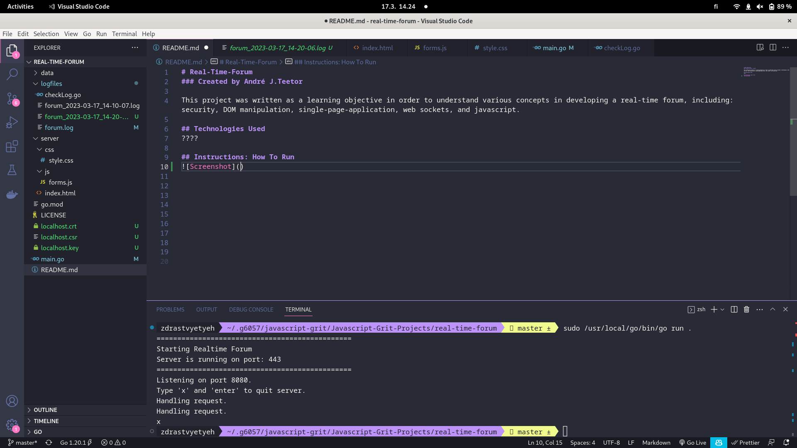

# Real-Time-Forum
### Created by André J.Teetor

This project was written as a learning objective in order to understand various concepts in developing a real-time forum, including: security, DOM manipulation, single-page-application, web sockets, and javascript.

## Technologies Used
????

## Instructions: How To Run

