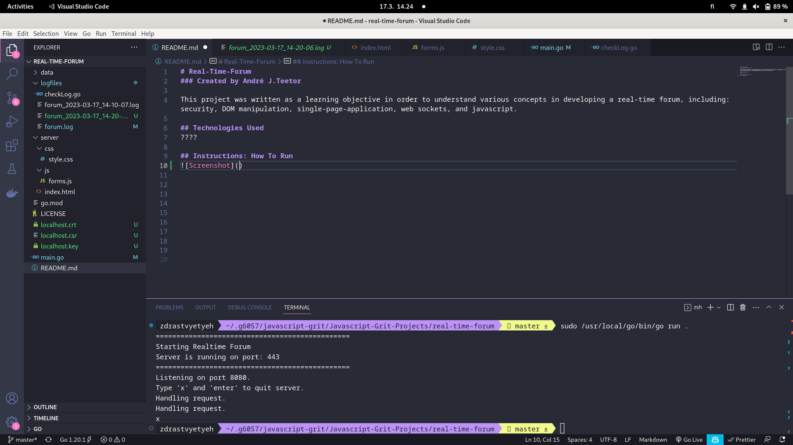

# Real-Time-Forum
#### Created by André J.Teetor

This project was written as a learning objective in order to understand various concepts in developing a real-time forum, including: security, DOM manipulation, single-page-application, web sockets, javascript, and sessions managers.

## Technologies Used
Websocket protocol

## Instructions: How To Run

Type the following in the repos root directory:

```
go run .
```

### Runtime configuration

You can run the server without `sudo` by using a non-privileged port:

```
PORT=8443 go run .
```

Optional environment variables:

- `PORT` (default `8443`)
- `TLS_CERT` (default `localhost.crt`)
- `TLS_KEY` (default `localhost.key`)
- `ALLOWED_ORIGIN` (default `https://localhost:8443`)

### SQLite compile warning (optional)

On some Linux toolchains, `go run .` can print a warning from `github.com/mattn/go-sqlite3` similar to:

`assignment discards 'const' qualifier from pointer target type`

This warning comes from SQLite C bindings during compilation and does not prevent the app from starting.

If you want to suppress it for local development:

```
CGO_CFLAGS="-Wno-discarded-qualifiers" PORT=8443 go run .
```





#### Notes on project:
1) When forms are sent, you must prevent the event default in order to prevent a page refresh.

2) Utilize 'comma ok' syntax:
    Ex. 
	if _, ok := m.clients[client]; ok {...} //Check if client exist in manager

3) Each websocket connection can only handle one read/write at a time for each connection, and YOU HAVE TO CLOSE THE CONNECTION FOR EACH ROUTINE!! (This could be indicated by double PINGS and PONGS)
        Two problems:
        
        a) Attempting to read/write on nil websocket connection
            "panic: runtime error: invalid memory address or nil pointer dereference"
            "Error:  websocket: close 1001 (going away)" //This triggered by refresh.

        b) Concurrently reading/writing on same websocket connection.
            "panic: concurrent write to websocket connection"
            "Error:  read tcp 127.0.0.1:443->127.0.0.1:43746: use of closed network connection"

4) Be aware of accidentally sending multiple signals on a single websocket connection.