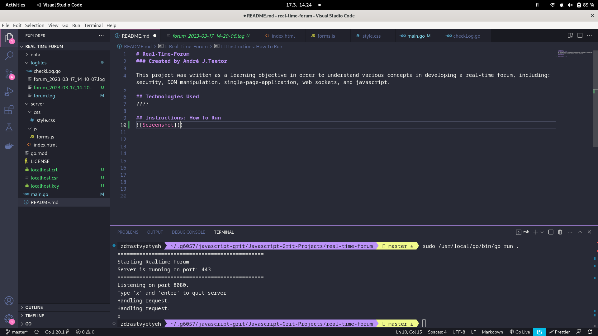

# Real-Time Forum

Created by André J. Teetor as a learning project to explore:

- HTTP + session-based auth
- WebSocket real-time messaging
- Single-page app frontend (React + TypeScript)
- SQLite persistence
- basic security and state management patterns

This repository runs a forum with posts/comments plus private chat and online-user presence.



## Tech Stack

- Backend: Go (`net/http`, `gorilla/websocket`)
- Database: SQLite (`github.com/mattn/go-sqlite3`)
- Frontend: React + TypeScript, built with Vite to static assets served by the Go binary
- Transport: HTTPS + WSS

## Repository Layout

- `main.go`: application entrypoint, HTTP routes, TLS server startup
- `websocket/`: HTTP handlers, WS manager/client/event logic
- `database/`: DB open/init helpers and SQL schema files
- `webapp/`: React + TypeScript frontend (source in `webapp/src`; `npm run build` produces `webapp/dist`, which the Go binary serves)
- `utility/`: password hashing, cookie helpers
- `tests/`: automated test suites and shared test helpers
- `logfiles/`: runtime logs

## Prerequisites

- Go (1.20+ recommended)
- Node.js + npm (for building/testing the React frontend in `webapp/`)
- OpenSSL (if generating local TLS certificates)
- Docker + Docker Compose (optional, for the containerized run path - see [Docker](#docker))

## Quick Start

From repository root:

```bash
cd database && ./createDB.sh && cd ..
cd webapp && npm install && npm run build && cd ..
PORT=8443 go run .
```

`go run .` serves whatever's already in `webapp/dist` — it doesn't build the
frontend itself, so that step has to run first (and again after any
`webapp/src` change). The [Docker](#docker) path builds it automatically
instead.

Then open:

- [https://localhost:8443](https://localhost:8443)

## Runtime Configuration

Environment variables:

- `PORT` (default: `8443`)
- `TLS_CERT` (default: `localhost.crt`)
- `TLS_KEY` (default: `localhost.key`)
- `ALLOWED_ORIGIN` (default: `https://localhost:8443`)

Example with explicit cert paths:

```bash
PORT=8443 TLS_CERT=localhost.crt TLS_KEY=localhost.key ALLOWED_ORIGIN=https://localhost:8443 go run .
```

## TLS Certificates (Local Development)

If certificate files do not exist, generate local ones:

```bash
openssl req -new -newkey rsa:2048 -nodes -keyout localhost.key -out localhost.csr
openssl x509 -req -days 365 -in localhost.csr -signkey localhost.key -out localhost.crt
```

Your browser may warn for self-signed certs; accept locally for development.

## Database

The app uses SQLite at `database/forum.db`. This file is not checked into git (see `.gitignore`), so it must be created locally before the first run:

```bash
cd database && ./createDB.sh && cd ..
```

- On startup, the app opens the DB connection; it does not create the schema itself.
- Schema/seed SQL lives in `database/createTables.sql`.
- The seeded categories and example posts support immediate local testing.
- `createDB.sh` only creates the file — rerunning it against an existing `forum.db` will fail because the tables already exist. Delete `database/forum.db` first if you want to reset to a clean seeded state.

## Docker

Generate `localhost.crt`/`localhost.key` first (see [TLS Certificates](#tls-certificates-local-development)), then:

```bash
docker compose up --build
```

- `docker-compose.yml` builds the app from the `Dockerfile` (multi-stage: `golang:1.25-bookworm` build stage, `debian:bookworm-slim` runtime) and maps port `8443`.
- `database/`, `logfiles/`, and the TLS cert/key are bind-mounted from the repo root, so the SQLite file and logs persist across container restarts and rebuilds.
- `docker-entrypoint.sh` creates `database/forum.db` from `database/createTables.sql` automatically on first run if it doesn't already exist - no manual `createDB.sh` step needed for the containerized path.
- Runtime config (`PORT`, `TLS_CERT`, `TLS_KEY`, `ALLOWED_ORIGIN`) is set via `environment:` in `docker-compose.yml`, same variables as running with `go run .` directly.

## Core Features

- User registration and login
- Session cookie auth (`session_id`)
- Post creation and category filtering
- Post comments
- Real-time private chat via WebSocket
- Live online-user list
- Typing indicator events
- Chat history pagination

## HTTP / WS Endpoints

HTTP:

- `GET /` - serves SPA entrypoint
- `POST /register`
- `POST /login`
- `POST /logout`
- `GET /checkLogin`
- `GET /getAllPosts`
- `POST /addPost`
- `POST /getPostsByCategory`
- `POST /addcomment`
- `GET /comments?postId=<id>`

WebSocket:

- `GET /ws?otp=<token>`

Event types include:

- `user-connect`
- `new-message` / `sent-message`
- `users-online`
- `typing` / `stop-typing`
- `get-chat-history` / `get-more-chat-history`
- `chat_history`

## Security Notes

Recent hardening includes:

- write endpoints (`/addPost`, `/addcomment`) now derive identity from authenticated session state rather than trusting client-sent user identity fields
- multiple frontend user-content render paths were moved from unsafe `innerHTML` usage to safer text-based rendering
- request-path fatal exits were removed from handlers in favor of safe HTTP error responses
- origin checks are now configurable through `ALLOWED_ORIGIN`
- per-IP rate limiting on `/login`, `/register`, `/addPost`, and `/addcomment` (see `utility/ratelimit.go`)
- input length/format validation on registration, login, posts, comments, and category filters at the API boundary (see `websocket/validate.go`)
- session cookie is rotated on login, actively cleared on logout, and expires server-side after 24h of inactivity with a sliding refresh on active use (see `Client.expired`/`Client.touch` in `websocket/ws-client.go` and `utility.RefreshCookie`/`ClearCookie`)
- state-changing routes (`/register`, `/login`, `/logout`, `/addPost`, `/addcomment`) reject requests whose `Origin` header doesn't match `ALLOWED_ORIGIN`, blocking cross-site CSRF submissions (see `websocket/csrf.go`)
- every response now carries a strict CSP plus `X-Content-Type-Options`, `X-Frame-Options`, `Referrer-Policy`, and HSTS headers (see `securityHeaders` in `main.go`)

## Development Workflow

Run server:

```bash
PORT=8443 go run .
```

Run all backend tests (requires CGO for SQLite):

```bash
CGO_ENABLED=1 CGO_CFLAGS="-Wno-discarded-qualifiers" go test ./...
```

Run frontend lint/typecheck/tests (from `webapp/`):

```bash
cd webapp
npm run lint
npm run typecheck
npm run test
```

Run the full local check (same as CI):

```bash
cd webapp && npm run lint && npm run typecheck && npm run test && npm run build && cd ..
CGO_ENABLED=1 CGO_CFLAGS="-Wno-discarded-qualifiers" go test ./...
```

## Continuous Integration

GitHub Actions runs on every push and pull request to `master` (see `.github/workflows/test.yml`):

- `webapp/`: `npm ci`, then lint, typecheck, test, and build the React frontend
- `go test ./...` with CGO enabled for SQLite
- `govulncheck ./...` to catch known-vulnerable Go dependencies

Dependabot (`.github/dependabot.yml`) opens weekly PRs for Go module, npm, and GitHub Actions updates.

## Testing

The backend has **37 automated tests** under `tests/`. Tests use an in-memory SQLite database so they do not touch `database/forum.db`.

### Test layout

```
tests/
├── testutil/          # shared in-memory DB setup
├── utility/           # password and cookie tests
└── websocket/         # HTTP handler, OTP, and WS event tests
```

| Location | Files | What is covered |
|----------|-------|-----------------|
| `tests/testutil/` | `database.go` | Shared in-memory SQLite schema and seed data |
| `tests/utility/` | `utility_test.go` | Password hashing/verification, session cookie creation and detection |
| `tests/websocket/` | `handlers_test.go` | Origin checks, post/comment auth enforcement |
| `tests/websocket/` | `handlers_auth_test.go` | Registration, login, logout, session status |
| `tests/websocket/` | `handlers_posts_test.go` | Posts, comments, category filtering |
| `tests/websocket/` | `otp_test.go` | One-time password creation, verification, expiry |
| `tests/websocket/` | `ws_events_test.go` | Chat messages, user presence, typing indicators, chat history |

Internal test hooks used by `tests/websocket/` live in `websocket/testhooks.go`.

### Coverage areas

- **Security**: WebSocket origin validation, session-based identity for writes (client-sent user IDs are ignored)
- **Auth**: Registration, login (valid/invalid credentials), logout, login status checks
- **Forum API**: Listing posts, filtering by category, adding posts with categories, reading and adding comments
- **Real-time**: OTP lifecycle, chat message persistence, online user broadcasts, typing/stop-typing events, chat history pagination

### Commands

Run all tests with coverage:

```bash
CGO_ENABLED=1 CGO_CFLAGS="-Wno-discarded-qualifiers" go test ./... -cover
```

Run a single test package:

```bash
CGO_ENABLED=1 go test ./tests/utility -v
CGO_ENABLED=1 go test ./tests/websocket -v
```

Run one test by name:

```bash
CGO_ENABLED=1 go test ./tests/websocket -run TestLoginHandler_Success -v
```

Current coverage (approximate, measured against source packages):

- `utility/`: ~93%
- `websocket/`: ~63%

Not yet covered: full WebSocket upgrade handshake, live connection read/write loops, and the `main`/`database`/`logfiles` packages.

## Troubleshooting

### 1) `go-sqlite3` warning during build

On some Linux toolchains you may see:

`assignment discards 'const' qualifier from pointer target type`

This comes from SQLite C bindings and does not usually block startup.

Optional local suppression:

```bash
CGO_CFLAGS="-Wno-discarded-qualifiers" PORT=8443 go run .
```

### 2) TLS handshake / browser certificate errors

- confirm cert/key paths match `TLS_CERT` and `TLS_KEY`
- ensure browser is using `https://localhost:<PORT>`
- accept self-signed cert for local dev

### 3) WebSocket fails to connect

- verify app is running over HTTPS (WSS requires secure context)
- confirm `ALLOWED_ORIGIN` matches browser origin exactly
- verify websocket URL host/port matches server

### 4) Port already in use

Use another local port:

```bash
PORT=9443 go run .
```

## Known Limitations

- Docker Compose (see [Docker](#docker)) gives a containerized single-instance run, but there's still no reverse proxy/TLS termination, log aggregation, or multi-instance orchestration for actual production deployment
- WebSocket connection lifecycle and server startup code are not yet covered by tests (backend or frontend — the frontend's reconnect logic is deliberately not deep-tested, see `webapp/src/contexts/WebSocketContext.tsx`)

## Contributing

1. Create a feature branch.
2. Keep changes small and focused.
3. Run lint/tests before opening a PR:
   - `cd webapp && npm run lint && npm run typecheck && npm run test && npm run build`
   - `CGO_ENABLED=1 CGO_CFLAGS="-Wno-discarded-qualifiers" go test ./...`
4. Include reproduction steps or test notes for bug fixes.

## License

Copyright (C) 2026 Andre Teetor

This project is licensed under the GNU General Public License v2.0 —
see the [LICENSE](LICENSE) file for details.