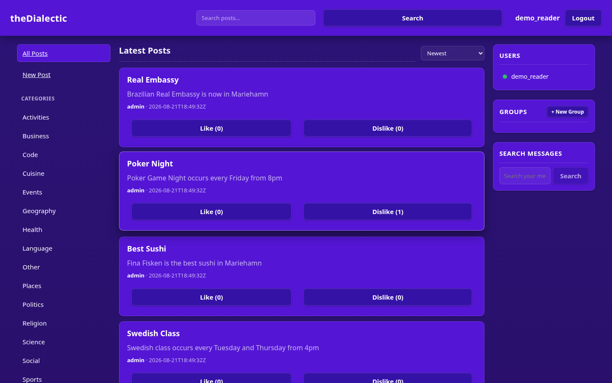

# Real-Time Forum

Created by André J. Teetor as a learning project to explore:

- HTTP + session-based auth
- WebSocket real-time messaging
- Single-page app frontend (React + TypeScript)
- SQLite persistence
- basic security and state management patterns

This repository runs a forum with posts (categories, reactions, images, search, sort) plus real-time private and group chat with online-user presence.



## Tech Stack

- Backend: Go (`net/http`, `gorilla/websocket`)
- Database: SQLite (`github.com/mattn/go-sqlite3`)
- Frontend: React + TypeScript, built with Vite to static assets served by the Go binary
- Transport: HTTPS + WSS

## Repository Layout

- `main.go`: application entrypoint, HTTP routes, TLS server startup
- `websocket/`: HTTP handlers, WS manager/client/event logic
- `database/`: DB open/init helpers and SQL schema files
- `webapp/`: React + TypeScript frontend (source in `webapp/src`; `npm run build` produces `webapp/dist`, which the Go binary serves)
- `utility/`: password hashing, cookie helpers
- `tests/`: automated Go test suites and shared test helpers
- `e2e/`: Playwright end-to-end suite (its own `package.json`, separate from `webapp/`'s)
- `logfiles/`: runtime logs

## Prerequisites

- Go (1.20+ recommended)
- Node.js + npm (for building/testing the React frontend in `webapp/`)
- OpenSSL (if generating local TLS certificates)
- Docker + Docker Compose (optional, for the containerized run path - see [Docker](#docker))

## Quick Start

From repository root:

```bash
cd database && ./createDB.sh && cd ..
cd webapp && npm install && npm run build && cd ..
PORT=8443 go run .
```

`go run .` serves whatever's already in `webapp/dist` — it doesn't build the
frontend itself, so that step has to run first (and again after any
`webapp/src` change). The [Docker](#docker) path builds it automatically
instead.

Then open:

- [https://localhost:8443](https://localhost:8443)

## Runtime Configuration

Environment variables:

- `PORT` (default: `8443`)
- `TLS_CERT` (default: `localhost.crt`)
- `TLS_KEY` (default: `localhost.key`)
- `ALLOWED_ORIGIN` (default: `https://localhost:8443`)

Example with explicit cert paths:

```bash
PORT=8443 TLS_CERT=localhost.crt TLS_KEY=localhost.key ALLOWED_ORIGIN=https://localhost:8443 go run .
```

## TLS Certificates (Local Development)

If certificate files do not exist, generate local ones:

```bash
openssl req -new -newkey rsa:2048 -nodes -keyout localhost.key -out localhost.csr
openssl x509 -req -days 365 -in localhost.csr -signkey localhost.key -out localhost.crt
```

Your browser may warn for self-signed certs; accept locally for development.

## Database

The app uses SQLite at `database/forum.db`. This file is not checked into git (see `.gitignore`), so it must be created locally before the first run:

```bash
cd database && ./createDB.sh && cd ..
```

- On startup, the app opens the DB connection; it does not create the schema itself.
- Schema/seed SQL lives in `database/createTables.sql`.
- The seeded categories and example posts support immediate local testing.
- `createDB.sh` only creates the file — rerunning it against an existing `forum.db` will fail because the tables already exist. Delete `database/forum.db` first if you want to reset to a clean seeded state.
- On every start, `database.OpenDB` also applies small idempotent schema migrations for columns added after `createTables.sql` was last touched (see `database/sqlFuncs.go`) — this is what lets an already-deployed database pick up a change like the `user.role` column without needing `forum.db` to be recreated.

## Admin Access

Admin-gated actions — category management (create/rename/delete), deleting any user's post or comment (not just your own), and user moderation (`GET /listUsers`, `POST /setUserBanned` to ban/unban) — are restricted to users whose `user.role` is `'admin'` (see `websocket.RequireAdmin`, re-checked server-side on every request regardless of what the client claims). There is no signup-time way to become an admin, and the seed data in `createTables.sql` does not insert a real `admin` user account (categories/posts reference `"admin"` only as a plain author string) — so on a fresh database, nobody starts as admin. Grant it manually once you have a real account to promote:

```bash
sqlite3 database/forum.db "UPDATE user SET role = 'admin' WHERE uname = '<your-username>';"
```

(The one built-in convenience: if a database happens to already have a real user literally named `admin`, the startup migration promotes that specific account automatically — harmless on databases that don't.)

## Docker

Generate `localhost.crt`/`localhost.key` first (see [TLS Certificates](#tls-certificates-local-development)), then:

```bash
docker compose up --build
```

- `docker-compose.yml` builds the app from the `Dockerfile` (multi-stage: `golang:1.25-bookworm` build stage, `debian:bookworm-slim` runtime) and maps port `8443`.
- `database/`, `logfiles/`, and the TLS cert/key are bind-mounted from the repo root, so the SQLite file and logs persist across container restarts and rebuilds.
- `docker-entrypoint.sh` creates `database/forum.db` from `database/createTables.sql` automatically on first run if it doesn't already exist - no manual `createDB.sh` step needed for the containerized path.
- Runtime config (`PORT`, `TLS_CERT`, `TLS_KEY`, `ALLOWED_ORIGIN`) is set via `environment:` in `docker-compose.yml`, same variables as running with `go run .` directly.

## Core Features

- User registration, login, and session cookie auth (`session_id`)
- Post creation, editing, and deletion, with category tagging
- Category browsing/filtering (multi-select) and admin category management
- Post sort/trending (newest, most liked, most commented)
- Like/dislike reactions on posts
- Image upload/attachment on posts
- Post comments, with edit/delete for the comment's own author
- Full-text search across posts and, separately, across a user's own private messages
- Real-time private (1:1) and group chat via WebSocket
- Live online-user list and typing indicators
- Chat history pagination, read receipts, and unread badges
- In-app and native browser chat notifications
- Admin moderation: delete any post/comment, ban/unban users

## HTTP / WS Endpoints

HTTP:

- `GET /` - serves SPA entrypoint
- `GET /healthz` - liveness/readiness check (pings the database); backs the Docker `HEALTHCHECK`
- `POST /register`
- `POST /login`
- `POST /logout`
- `GET /checkLogin`
- `GET /getAllPosts` (`?limit=&offset=&sort=`)
- `GET /getPostsByAuthor` (`?author=&limit=&offset=&sort=`)
- `GET /getPost` (`?id=`)
- `POST /addPost`
- `POST /editPost`
- `POST /deletePost` - own post, or any post if admin
- `POST /reactToPost`
- `POST /uploadPostImage`
- `POST /getPostsByCategory` (`?limit=&offset=&sort=`)
- `GET /searchPosts` (`?q=&sort=`)
- `GET /searchMessages` (`?q=`)
- `GET /getCategories`
- `GET /getPostCategories` (`?postId=`)
- `POST /createCategory`, `POST /editCategory`, `POST /deleteCategory` - admin-only
- `GET /listUsers`, `POST /setUserBanned` - admin-only
- `POST /addcomment`
- `POST /editComment`
- `POST /deleteComment` - own comment, or any comment if admin
- `GET /comments` (`?postId=&limit=&offset=`)

WebSocket:

- `GET /ws?otp=<token>`

Event types include:

- `user-connect` / `users-online`
- `open-direct-chat` / `create-group-chat` / `chat-opened` / `chat-error`
- `get-conversations` / `conversations-list`
- `new-message` / `sent-message` / `message-ack`
- `get-chat-history` / `get-more-chat-history` / `chat_history`
- `typing` / `stop-typing`
- `mark-read` / `read-receipt`

## Security Notes

Recent hardening includes:

- write endpoints (`/addPost`, `/addcomment`) now derive identity from authenticated session state rather than trusting client-sent user identity fields
- multiple frontend user-content render paths were moved from unsafe `innerHTML` usage to safer text-based rendering
- request-path fatal exits were removed from handlers in favor of safe HTTP error responses
- origin checks are now configurable through `ALLOWED_ORIGIN`
- per-IP rate limiting on every write endpoint plus the read-only listing/search endpoints, each rejecting over-limit requests with `429` and a `Retry-After` header (see `utility/ratelimit.go`)
- input length/format validation on registration, login, posts, comments, category filters, and chat messages at the API boundary (see `websocket/validate.go`) — a chat message previously had no server-side bound, and an over-sized WebSocket frame would silently kill the whole connection rather than being rejected gracefully
- session cookie is rotated on login, actively cleared on logout, and expires server-side after 24h of inactivity with a sliding refresh on active use (see `Client.expired`/`Client.touch` in `websocket/ws-client.go` and `utility.RefreshCookie`/`ClearCookie`)
- state-changing routes reject requests whose `Origin` header doesn't match `ALLOWED_ORIGIN`, blocking cross-site CSRF submissions (see `websocket/csrf.go`)
- every response carries a strict CSP plus `X-Content-Type-Options`, `X-Frame-Options`, `Referrer-Policy`, and HSTS headers (see `securityHeaders` in `main.go`)
- admin-gated actions (category management, delete-any-post/comment, user ban) are re-verified server-side on every request, never trusted from client-sent role claims (see `websocket.RequireAdmin`/`isAdmin`)
- the Docker image runs as a fixed non-root user (uid/gid 1000), not root
- structured logging (`log/slog`) throughout the backend, with explicit redaction of credentials, session IDs, OTP keys, and private message content from log output

## Development Workflow

Run server:

```bash
PORT=8443 go run .
```

Run all backend tests (requires CGO for SQLite):

```bash
CGO_ENABLED=1 CGO_CFLAGS="-Wno-discarded-qualifiers" go test ./...
```

Run frontend lint/typecheck/tests (from `webapp/`):

```bash
cd webapp
npm run lint
npm run typecheck
npm run test
```

Run the full local check (same as CI):

```bash
cd webapp && npm run lint && npm run typecheck && npm run test && npm run build && cd ..
CGO_ENABLED=1 CGO_CFLAGS="-Wno-discarded-qualifiers" go test ./...
```

## Continuous Integration

GitHub Actions runs on every push and pull request to `master` (see `.github/workflows/test.yml`), as two jobs:

- `test`: `webapp/`: `npm ci`, then lint, typecheck, test, and build the React frontend; `go test ./...` with CGO enabled for SQLite; `govulncheck ./...` to catch known-vulnerable Go dependencies
- `e2e` (`needs: test`, so it only runs once the above passes): installs Playwright + Chromium and runs the E2E suite (see [Testing](#testing)) against the actual built app

Dependabot (`.github/dependabot.yml`) opens weekly PRs for Go module, npm, and GitHub Actions updates.

## Testing

The backend has **~190 automated tests** across `main_test.go` and `tests/` (Go), and the frontend has **~140 tests** under `webapp/src/**/*.test.{ts,tsx}` (Vitest + React Testing Library). Go tests use an in-memory SQLite database so they do not touch `database/forum.db`.

### Test layout

```
main_test.go            # healthz handler, security headers
tests/
├── database/           # schema migrations (fresh DB and already-deployed-DB paths)
├── testutil/           # shared in-memory DB setup
├── utility/            # password/cookie helpers, IP rate limiter
└── websocket/          # HTTP handlers, WS event routing, OTP, real end-to-end WS upgrade tests
```

Internal test hooks used by `tests/websocket/` live in `websocket/testhooks.go`.

### Coverage areas

- **Security**: origin/CSRF validation, session-based identity for writes (client-sent user/role fields are always ignored server-side), admin-gate re-verification, rate limiting (burst/refill/per-IP isolation/`Retry-After`), password hashing, credential redaction in logs
- **Auth**: registration, login (valid/invalid/banned), logout, session expiry and OTP lifecycle
- **Forum API**: posts (CRUD, category tagging, sort/trending, search), comments (CRUD), category management, reactions, image upload
- **Real-time**: real WebSocket upgrade handshake and event routing (not just handler functions in isolation), direct/group chat creation (including a concurrency/race-safety test), message send/history/search, typing indicators, read receipts, reconnect backoff (frontend)
- **Moderation**: delete-any-post/comment, ban/unban and its immediate effect on a live connection
- **Migrations**: idempotency, and correctness against both a fresh schema and an already-deployed one predating each change

### End-to-end tests (`e2e/`)

A small Playwright suite drives the actual built frontend against the actual running Go server — the one thing the Go/Vitest suites above structurally can't do, since they each only exercise their own layer. Deliberately modest in scope (a smoke suite, not a re-run of what's already covered): register/login, create a post and view it, and two real browser sessions exchanging a chat message in real time over a live WebSocket connection.

It builds its own disposable SQLite database and Go binary and runs them on a dedicated port (`8543`) via `e2e/setup/run-server.sh`, so it never touches a developer's real `database/forum.db` or collides with an already-running dev/Docker instance on `8443`.

```bash
cd e2e
npm ci
npx playwright install --with-deps chromium   # first time only
npx playwright test
```

### Commands

Run all tests with coverage:

```bash
CGO_ENABLED=1 CGO_CFLAGS="-Wno-discarded-qualifiers" go test ./... -cover
```

Run a single test package:

```bash
CGO_ENABLED=1 go test ./tests/utility -v
CGO_ENABLED=1 go test ./tests/websocket -v
```

Run one test by name:

```bash
CGO_ENABLED=1 go test ./tests/websocket -run TestLoginHandler_Success -v
```

Current coverage (`go test ./tests/... -coverpkg=./websocket/...,./utility/...,./database/... -coverprofile=...`, plus `main_test.go`'s own in-package coverage):

- `websocket/`: ~77%
- `utility/`: ~57%
- `database/`: ~36%
- `main` (root package): ~2% — only `healthzHandler` and `securityHeaders` are unit-tested; route registration and TLS server startup are exercised live (Docker + manual/browser verification) but not by `go test`

Lagging areas: `database/` (mostly the historical one-time migration helpers, exercised structurally rather than line-by-line), and anything in `main.go` beyond the two handlers above.

## Troubleshooting

### 1) `go-sqlite3` warning during build

On some Linux toolchains you may see:

`assignment discards 'const' qualifier from pointer target type`

This comes from SQLite C bindings and does not usually block startup.

Optional local suppression:

```bash
CGO_CFLAGS="-Wno-discarded-qualifiers" PORT=8443 go run .
```

### 2) TLS handshake / browser certificate errors

- confirm cert/key paths match `TLS_CERT` and `TLS_KEY`
- ensure browser is using `https://localhost:<PORT>`
- accept self-signed cert for local dev

### 3) WebSocket fails to connect

- verify app is running over HTTPS (WSS requires secure context)
- confirm `ALLOWED_ORIGIN` matches browser origin exactly
- verify websocket URL host/port matches server

### 4) Port already in use

Use another local port:

```bash
PORT=9443 go run .
```

## Known Limitations

- Docker Compose (see [Docker](#docker)) gives a containerized single-instance run, but there's still no reverse proxy/TLS termination, log aggregation, or multi-instance orchestration for actual production deployment
- No self-service password reset or recovery — there's no email-sending capability in this app, so a lost password currently requires direct database access, the same way promoting an admin does (see [Admin Access](#admin-access))
- The E2E suite (see [Testing](#testing)) is intentionally a small smoke suite (auth, posting, one real-time chat exchange) — it isn't a substitute for exhaustive manual/exploratory testing of every feature combination

## Contributing

1. Create a feature branch.
2. Keep changes small and focused.
3. Run lint/tests before opening a PR:
   - `cd webapp && npm run lint && npm run typecheck && npm run test && npm run build`
   - `CGO_ENABLED=1 CGO_CFLAGS="-Wno-discarded-qualifiers" go test ./...`
4. Include reproduction steps or test notes for bug fixes.

## License

Copyright (C) 2026 Andre Teetor

This project is licensed under the GNU General Public License v2.0 —
see the [LICENSE](LICENSE) file for details.